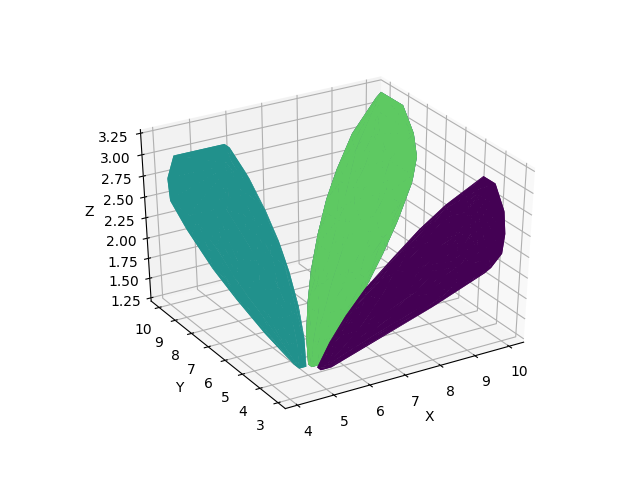
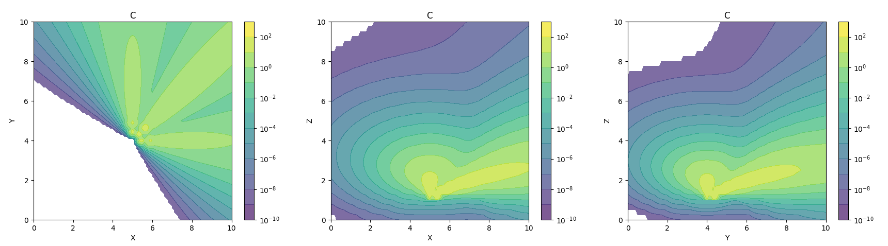
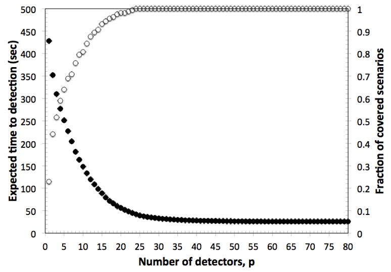
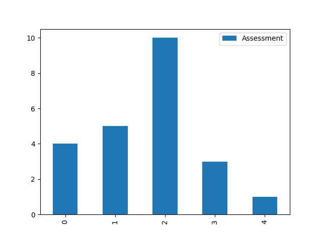

.. raw:: latex

    \newpage

.. _graphics:

Graphics
===========================

The :mod:`chama.graphics` module provides methods to help visualize results. 

Signal graphics
---------------------------
Chama provides several functions to visualize signals described in the 
:ref:`simulation` section (XYZ format only). Visualization is useful to verify that
the signal was loaded/generated as expected, compare scenarios, and to 
better understand optimal sensor placement.

The convex hull of several scenarios can be generated as follows (:numref:`fig-chull`):

.. doctest::
    :hide:

    >>> import chama
	>>> import numpy as np
    >>> import pandas as pd
    >>> pd.set_option('display.max_columns', 20)
    >>> x, y, z, t = np.meshgrid([1, 2], [1, 2], [1, 2], [0, 10, 20])
    >>> signal = pd.DataFrame({'X': z.flatten(),'Y': x.flatten(),'Z': y.flatten(),'T': t.flatten(),
    ...		'S1': [0,0,0,0.2,0.32,0.45,0.23,0.64,0.25,0.44,0.25,0.82,0.96,0.61,0.92,0.41,0.42,0,0,0,0,0,0,0],
    ...		'S2': [0,0,0,0.2,0.14,0.58,0.47,0.12,0.54,0.15,0.28,0.12,0.53,0.23,0.82,0.84,0.87,0.51,0,0,0,0,0,0],
    ...     'S3': [0,0.01,0,0.2,0.14,0.58,0.47,0.12,0.54,0.45,0.68,0.12,0.53,0.23,0.82,0.84,0.87,0.51,0.13,0,0,0,0,0]})
    >>> signal = signal[['X', 'Y', 'Z', 'T', 'S1','S2', 'S3']]
	
.. doctest::

    >>> chama.graphics.signal_convexhull(signal, scenarios=['S1', 'S2', 'S3'], threshold=0.01)
	
.. _fig-chull:

   
   Convex hull plot

The cross section of a single scenarios can be generated as follows (:numref:`fig-xsection`):

.. doctest::

    >>> chama.graphics.signal_xsection(signal, 'S1', threshold=0.01)
	
.. _fig-xsection:

   
   Cross section plot

Sensor graphics
---------------------

The position of fixed and mobile sensors, described in the :ref:`sensors` section, 
can be plotted.  After grouping sensors in a dictionary, the locations can be 
plotted as follows (:numref:`fig-sensorloc`):

.. doctest::
    :hide:

    >>> import chama
	>>> import numpy as np
    >>> import pandas as pd
    >>> sensors = {}
	>>> z = 20
    >>> drone_path = chama.sensors.Mobile(locations=[
    ...     (100,100,z), (400,100,z), (420,150,z), 
    ...     (400,200,z), (100,200,z), ( 80,250,z),
    ...     (100,300,z), (400,300,z), (420,350,z),
    ...     (400,400,z), (100,400,z)], 
    ...     speed=0.04701, start_time=8*3600) 
    >>> drone_camera = chama.sensors.Camera(threshold=100, 
    ...     sample_times=[0], direction=(0,0,-1))
    >>> drone = chama.sensors.Sensor(position=drone_path, detector=drone_camera)
    >>> sensors['Drone' + str(z)] = drone
	>>> dist_loc = chama.sensors.Stationary(location=(100,200,5))
    >>> dist_pt = chama.sensors.Point(threshold=0.1, sample_times=[0])
    >>> dist = chama.sensors.Sensor(position=dist_loc, detector=dist_pt)
    >>> sensors['Dist1'] = dist
    >>> dist_loc = chama.sensors.Stationary(location=(200,300,10))
    >>> dist_pt = chama.sensors.Point(threshold=0.1, sample_times=[0])
    >>> dist = chama.sensors.Sensor(position=dist_loc, detector=dist_pt)
    >>> sensors['Dist2'] = dist
    >>> dist_loc = chama.sensors.Stationary(location=(200,400,8))
    >>> dist_pt = chama.sensors.Point(threshold=0.1, sample_times=[0])
    >>> dist = chama.sensors.Sensor(position=dist_loc, detector=dist_pt)
    >>> sensors['Dist3'] = dist
	
.. doctest::

	>>> chama.graphics.sensor_locations(sensors)
	
.. doctest::
    :hide:
	
	>>> #import matplotlib.pylab as plt 
    >>> #plt.gcf()
    >>> #plt.savefig('sensorloc.png')

.. _fig-sensorloc:
.. figure:: figures/sensorloc.png
   :scale: 70 %
   
   Mobile and stationary sensor locations plot
   
Tradeoff curves
---------------------------

After running a series of sensor placement optimizations with increasing sensor budget, a tradeoff
curve can be generated using the objective value and fraction of detected scenarios.  :numref:`fig-tradeoff` 
compares the expected time to detection and scenario coverage as the sensor 
budget increases.

.. _fig-tradeoff:

   
   Optimization tradeoff curve

Scenario analysis
---------------------------

The impact of individual scenarios can also be analyzed for a single sensor placement using the 
optimization assessment.  :numref:`fig-scenarioimpact`  compares
time to detection from several scenarios, given an optimal placement.

.. doctest::
    :hide:

    >>> results = {}
    >>> results['Assessment'] = pd.DataFrame(data =  [['S1', 'A', 4], ['S2', 'A', 5],['S3', 'B', 10],['S4', 'C', 3],['S5', 'A', 1]],
    ...    columns=['Scenario', 'Sensor', 'Impact'])
    >>> results['Assessment'] = results['Assessment'][['Scenario', 'Sensor', 'Impact']]
	
.. doctest::

    >>> print(results['Assessment'])
      Scenario Sensor  Impact
    0       S1      A       4
    1       S2      A       5
    2       S3      B      10
    3       S4      C       3
    4       S5      A       1
    >>> results['Assessment'].plot(kind='bar') #doctest:+SKIP 

.. doctest::
    :hide:
	
	>>> #import matplotlib.pylab as plt 
    >>> #plt.gcf()
    >>> #plt.savefig('scenarioimpact.png')

.. _fig-scenarioimpact:

   
   Scenario impact values based on optimal placement
