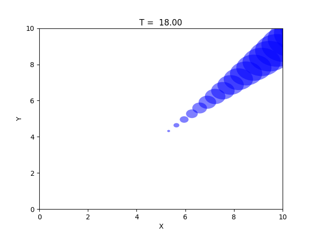

.. raw:: latex

    \newpage

.. _graphics:

Graphics
===========================

The :mod:`chama.graphics` module provides methods to help visualize results. 

Signal graphics
---------------------------
Chama provides several functions to visualize signals described in the 
:ref:`transport` section. Visualization is useful to verify that
the signal was loaded/generated as expected, compare scenarios, and to 
better understand optimal sensor placement.

The convex hull of several scenarios can be generated as follows:

.. doctest::
    :hide:

    >>> import chama
	>>> import numpy as np
    >>> import pandas as pd
    >>> x, y, z, t = np.meshgrid([1, 2], [1, 2], [1, 2], [0, 10, 20])
    >>> signal = pd.DataFrame({'X': z.flatten(),'Y': x.flatten(),'Z': y.flatten(),'T': t.flatten(),
    ...		'S1': [0,0,0,0.2,0.32,0.45,0.23,0.64,0.25,0.44,0.25,0.82,0.96,0.61,0.92,0.41,0.42,0,0,0,0,0,0,0],
    ...		'S2': [0,0,0,0.2,0.14,0.58,0.47,0.12,0.54,0.15,0.28,0.12,0.53,0.23,0.82,0.84,0.87,0.51,0,0,0,0,0,0],
    ...     'S3': [0,0.01,0,0.2,0.14,0.58,0.47,0.12,0.54,0.45,0.68,0.12,0.53,0.23,0.82,0.84,0.87,0.51,0.13,0,0,0,0,0]})
    >>> signal = signal[['X', 'Y', 'Z', 'T', 'S1','S2', 'S3']]
	
.. doctest::

    >>> chama.graphics.signal_convexhull(signal, scenarios=['S1', 'S2', 'S3'], threshold=0.01)
	
.. _fig-chull:
.. figure:: figures/convexhull_plot.png
   :scale: 75 %
   
   Sample convex hull plot

The cross section of a single scenarios can be generated as follows:

.. doctest::

    >>> chama.graphics.signal_xsection(signal, 'S1', threshold=0.01)
	
.. _fig-xsection:
.. figure:: figures/xsection_plot.png
   :scale: 100 %
   
   Sample cross section plot
   
One of the internal simulation engines included in Chama is a Gaussian puff air dispersion
model. Using the puff example defined in the :ref:`transport` section, 
the movements of each puff over the simulation horizon can be visualized as follows:

.. doctest::
    :hide:
	
    >>> x_grid = np.linspace(-100, 100, 21)
    >>> y_grid = np.linspace(-100, 100, 21)
    >>> z_grid = np.linspace(0, 40, 21)
    >>> grid = chama.transport.Grid(x_grid, y_grid, z_grid)
	>>> source = chama.transport.Source(-20, 20, 1, 1.5)
	>>> atm = pd.DataFrame({'Wind Direction': [45,120,200], 'Wind Speed': [1.2,1,1.8], 'Stability Class': ['A','B','C']}, index=[0,10,20])	
	>>> gauss_puff = chama.transport.GaussianPuff(grid, source, atm, tpuff=1, tend=20)
	>>> gauss_puff.run(grid, 10)
	
.. doctest::

	>>> #chama.graphics.animate_puffs(gauss_puff.puff)
	
.. _fig-puff:

   
   Sample frame from Gaussian puff animation

Sensor graphics
---------------------

* Plot the location of sensors on a map (KML or using matplotlib)

* All feasible sensors or selected sensors, color by impact.

Tradeoff curves
---------------------------

* Plot objective using several sensor placements, increasing budget.  Minimize time and coverage?

Scenario analysis
---------------------------

* histogram showing impact from all scenarios, based on optimal sensor placement.