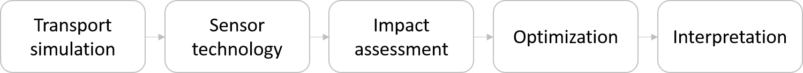

.. raw:: latex
	
    \newpage
	\listoffigures
	\newpage
	\pagenumbering{arabic}
	\setcounter{page}{1}

Overview
========

Continuous or regularly scheduled monitoring has the potential to quickly
identify changes in the environment. However, even with low-cost sensors,
only a limited number of sensors can be deployed. The physical placement of
these sensors, along with the sensor technology and operating conditions,
can have a large impact on the performance of a monitoring strategy.

Chama is an open source Python package which includes mixed-integer,
stochastic programming formulations to determine sensor locations and
technology that maximize monitoring effectiveness. Some of the methods in
Chama were originally developed by Sandia National Laboratories and the U.S.
Environmental Protection Agency to design sensor networks for water
utilities. The basic sensor placement optimization method included in Chama
is based on methods in the Threat Ensemble Vulnerability Assessment and
Sensor Placement Optimization Tool (TEVA-SPOT) [USEPA12]_ and the Water
Security Toolkit (WST) [USEPA15]_. TEVA-SPOT and WST combine contaminant
transport simulations using the water distribution network model EPANET
[Ross00]_ with impact assessment and sensor placement optimization methods.

Chama was developed to be a general purpose sensor placement optimization
software tool. The software is intended to be used by regulatory agencies,
industry, and the research community. Chama expands on previous software
tools by allowing the user to optimize both the location and type of sensors
in a monitoring system. Chama includes functionality to define point and
camera sensors that can be stationary or mobile. Furthermore, transport
simulations can represent a wide range of applications, including (but not
limited to):

* Atmospheric dispersion
* Liquid and gas transport through pipe networks
* Surface and ground water transport
* Seismic wave propagation

The basic steps required for sensor placement optimization using Chama are
shown in :numref:`fig-flowchart`.

.. _fig-flowchart:

   
   Basic steps in sensor placement optimization using Chama.
   
* :ref:`transport`: Generate an ensemble of transport simulations
  representative of the system in which sensors will be deployed.
* :ref:`sensors`: Define a set of feasible sensor technologies, including
  stationary and mobile sensors, point detectors and cameras.
* :ref:`impact`: Extract the impact of detecting transport simulations given
  a set of sensor technologies.
* :ref:`optimization`: Optimize sensor location and type given a sensor
  budget.
* :ref:`graphics`: Generate maps of the site that include the optimal sensor
  layout and information about scenarios that were and were not detected.

The following documentation includes additional information on these steps,
along with installation instructions, software application programming
interface (API), and software license.  It is assumed that the reader is
familiar with the Python Programming Language.  References are included for
additional background on software components.
